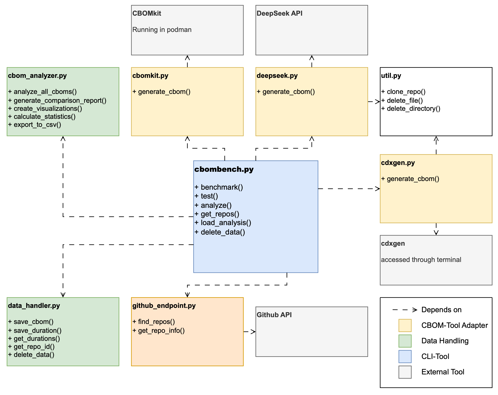

[](https://github.com/SEG-UNIBE/cbombench/releases)
[](https://github.com/SEG-UNIBE/cbombench/blob/main/LICENSE)
[](https://doi.org/10.5281/zenodo.15878453)

---

# CBOMbench


CBOMbench is a modular benchmarking framework for evaluating **Cryptographic Bill of Materials (CBOM)** generation tools. It automates testing of CBOM tools across real-world GitHub repositories and produces analysis based on output quality and performance metrics.

This tool was developed as part of a bachelor’s thesis at the University of Bern and currently supports benchmarking of:
- [IBM's CBOMkit](https://github.com/PQCA/cbomkit)
- [CycloneDX's cdxgen](https://github.com/CycloneDX/cdxgen)
- [DeepSeek for LLM-based CBOM-generation](https://www.deepseek.com/)

## Installation & Setup
To run CBOMbench, follow these steps:
#### 1. Install Required Tools
- Follow the official instructions to install [CBOMkit](https://github.com/PQCA/cbomkit) (via Docker or Podman).
- Install [cdxgen](https://github.com/CycloneDX/cdxgen) using npm: ```npm install -g @cyclonedx/cdxgen```

#### 2. Clone this Repository
```bash 
git clone https://github.com/SEG-UNIBE/cbombench.git
cd cbombench
```

#### 3. Install Python Dependencies
```bash
pip install -r requirements.txt 
```

#### 4. Set Environment Variables
```bash
export DEEPSEEK_API_KEY=your_deepseek_key_here
export GITHUB_TOKEN=your_github_token_here
```

## Usage
CBOMbench is operated through the command-line: 
```python ./src/cbombench.py [COMMAND]```

### Available Commands:
- **Repository Discovery and Selection**

    Get Github Repositories filtered by main programming language, size constraints in KB and how big the sample should be.

    ```cbombench.py get-repos --languag java --min-size 1000 --max-size 100000 --sample-size 10```
  
- **Individual Tool Testing**

    Individual tool testing for a specified repository and branch (if branch is left empty CBOMbench automatically detects the default branch).

    ```cbombench.py text cbomkit cdxgen deepseek https://github.com/example/repo --branch main```

- **Automated Benchmarking**

    Benchmarking the specified tools on a sample of GitHub repositories

    ```cbombench.py benchmark cbomkit cdxgen deepseek --language java --sample-size 10```

- **Statistical Analysis and Reporting**

    Generate comparison reports from the collected CBOMs (save flag to save report in files).

    ```cbombench.py analyze --save```

- **Historical Analysis**

    Load a past analysis

    ```cbombench.py load-analysis```

- **Data Cleanup**

    Delete generated CBOMs

    ```cbombench.py delete-data```

## Extending CBOMbench
To add support for a new CBOM generation tool:
1. Create a new adapter
2. Implement a generate_cbom(url, branch) method that returns the CBOM as a JSON and a duration
3. Add the function to ```cbombench.py```